# PDIG UI vNext — 截图画廊（Markdown 版，GitHub 可直接渲染）

> No-Vision Blind Agent 证据陈列；审美判定 = `NEEDS_HUMAN_OR_VISION_MODEL`。全部 synthetic fixture，隐私遮蔽开启。

## 1. Desktop — 10 屏（1920×1080 @1.0，global 相机）

### now

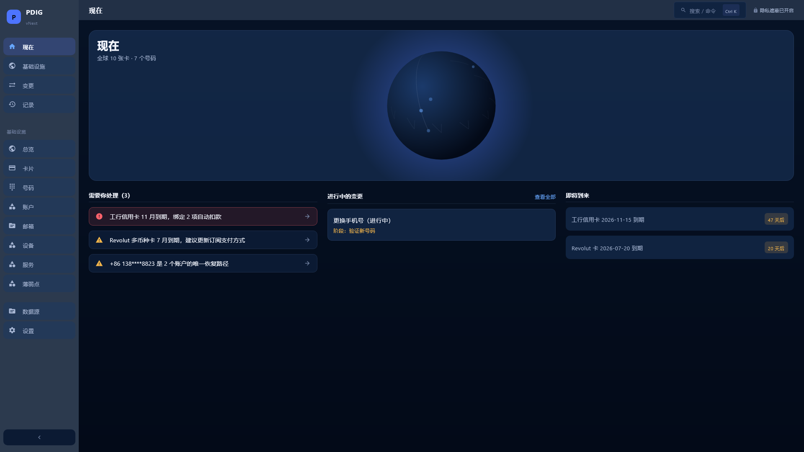

### infrastructure-overview

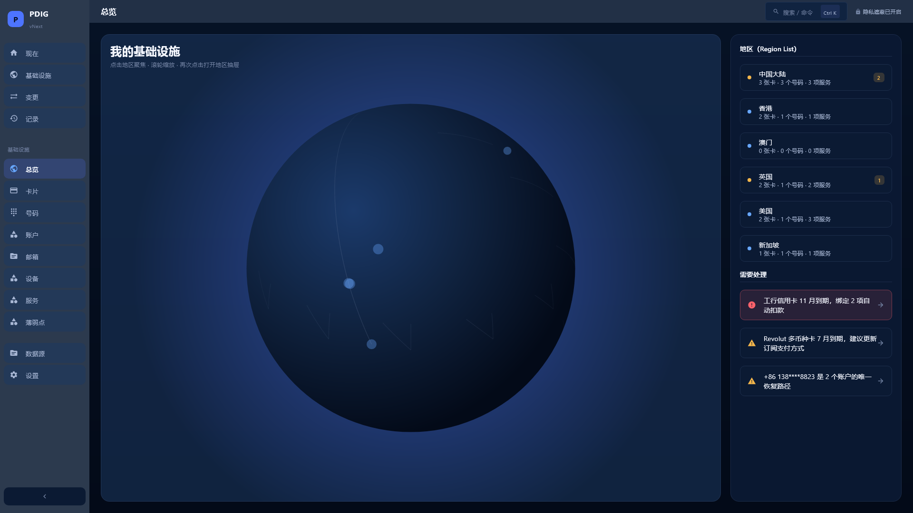

### cards

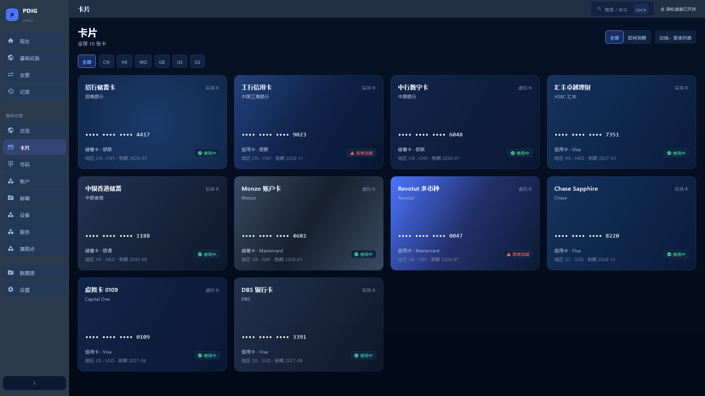

### card-detail

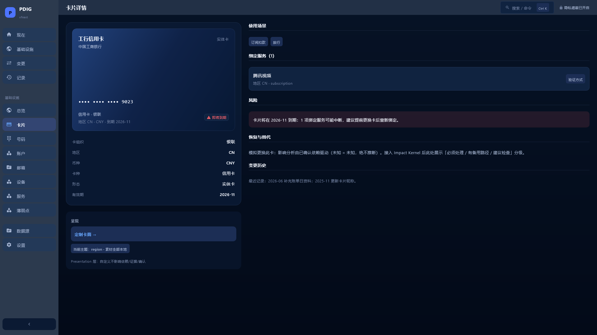

### numbers

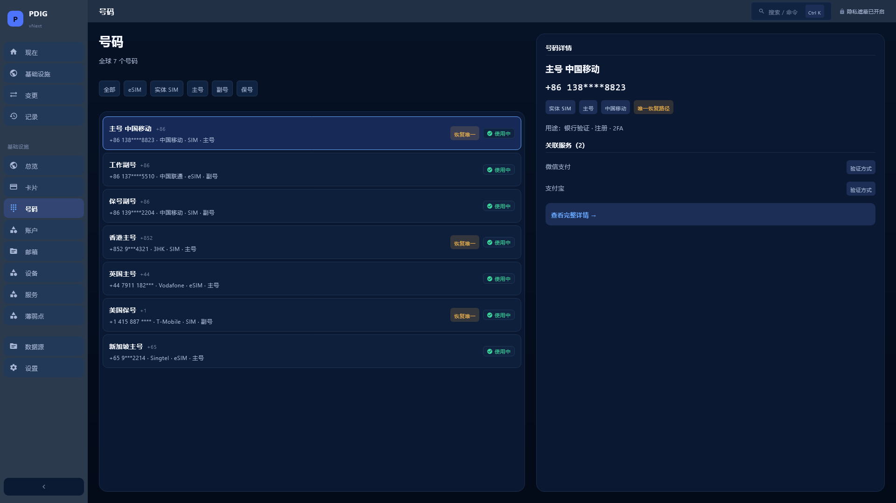

### number-detail

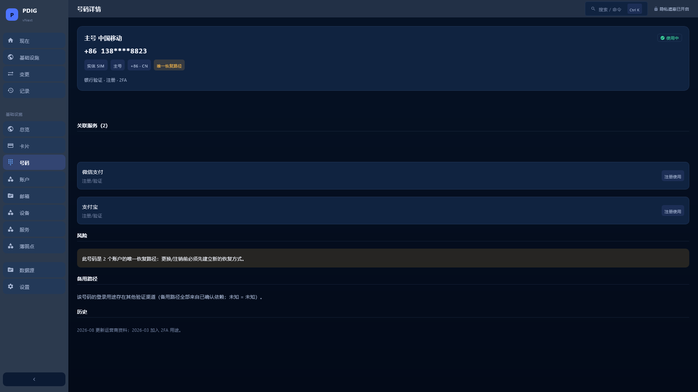

### change-phone

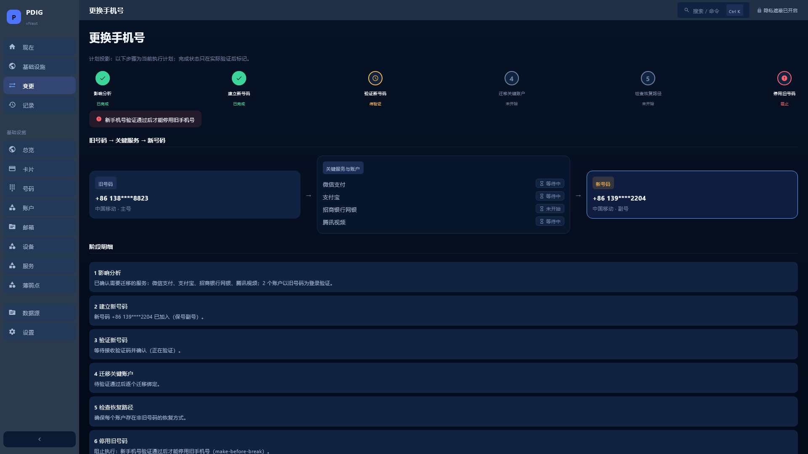

### card-customization

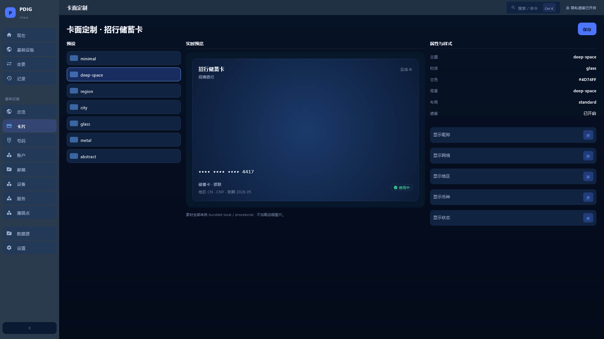

### number-customization

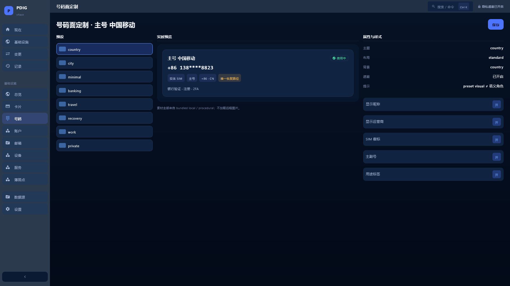

### personalization-center

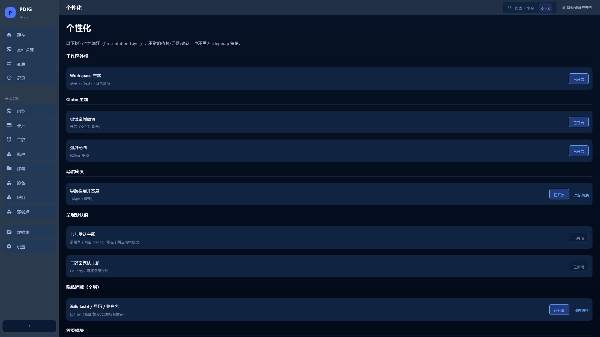

## 2. Infrastructure Overview — Globe 相机预设（1920×1080）

### camera: global

### camera: cn

### camera: hk

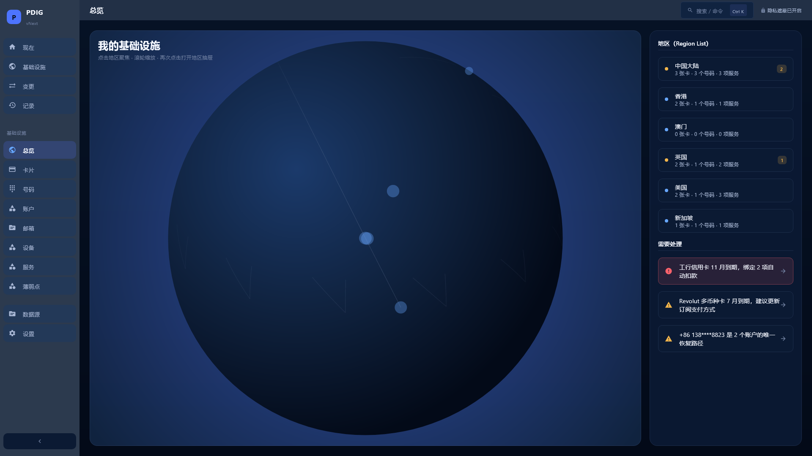

### camera: gb

### camera: us

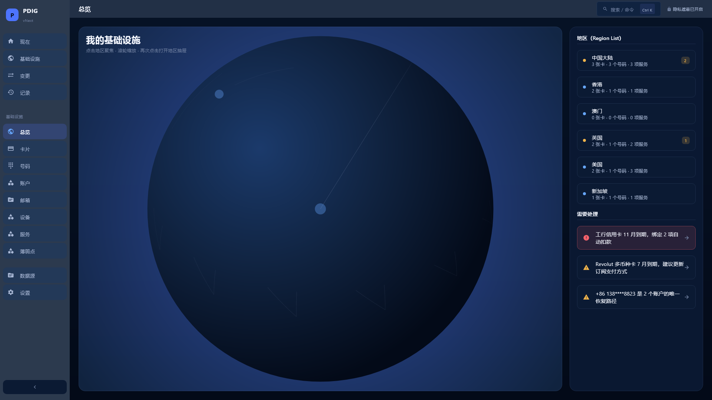

## 3. Android — API36 AVD 设备截图（light）

### 01-vnext-now

### 02-vnext-infra-overview

### 03-vnext-change

### 04-vnext-records

### 05-vnext-now-back

## 4. 评审包

- `artifacts/ui-vnext-review/desktop/UI_LAYOUT_PROBE.json`（几何探针）
- `artifacts/ui-vnext-review/IMAGE_METRICS.json`（90 帧量化指标）
- `artifacts/ui-vnext-review/TOKEN_MANIFEST.json` / `TEST_RESULTS.json` / `VISION_REVIEW_TEMPLATE.json`
- iOS 截图：GitHub Actions run [36667427702](https://github.com/huangdi97/PDIG-DepMap/actions/runs/36667427702) artifact `ios-runtime-visual-evidence`（需登录）
