# PDIG UI vNext — PHASE 1B 关键帧（Desktop Visual Fidelity Iteration 2）

> No-Vision Blind Agent 证据陈列。VISUAL_FIDELITY_ITERATION_2 = COMPLETE，NEEDS_HUMAN_REVIEW = TRUE，VISUAL_CRAFT = NEEDS_HUMAN_OR_VISION_REVIEW（永不 PASS）。全部 synthetic fixture，隐私遮蔽开启。

依据 Human Visual Review 2026-10-01 的 15 张最小证据集（Review §22）：

### A. Now

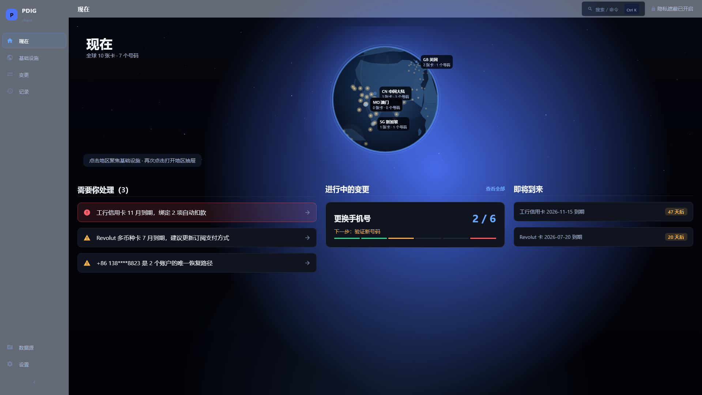

### B. Infrastructure Overview

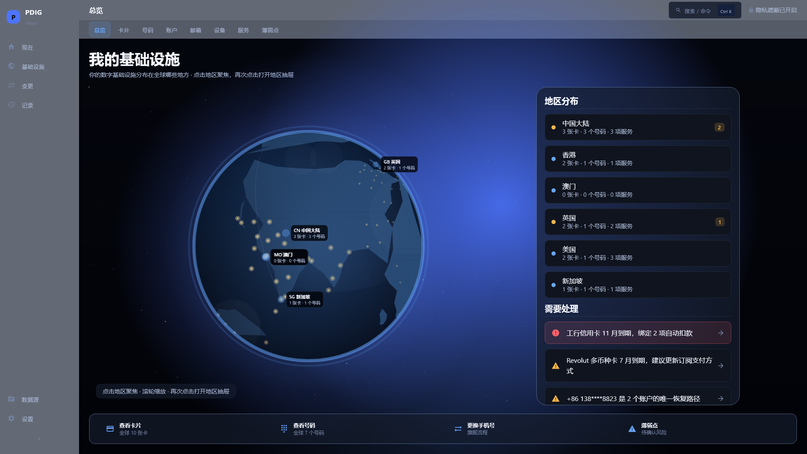

### C. Overview · HK 聚焦+过滤

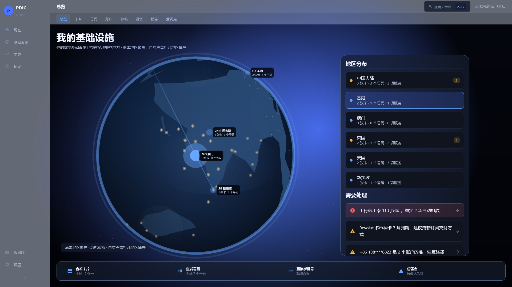

### D. Cards

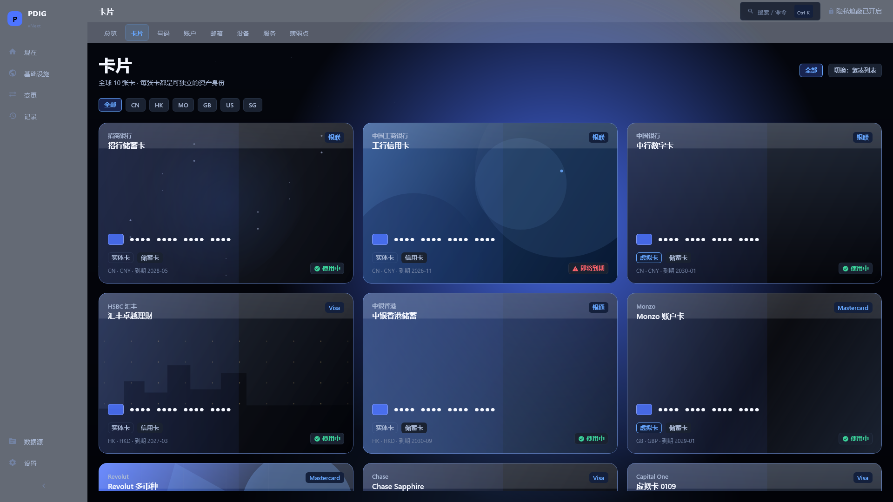

### E. Card Detail

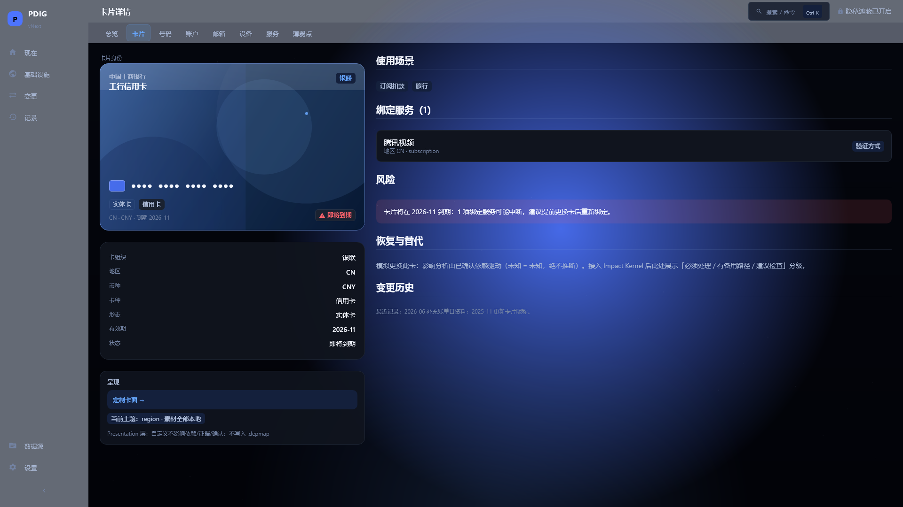

### F1. Card Customization · minimal

### F2. Card Customization · glass

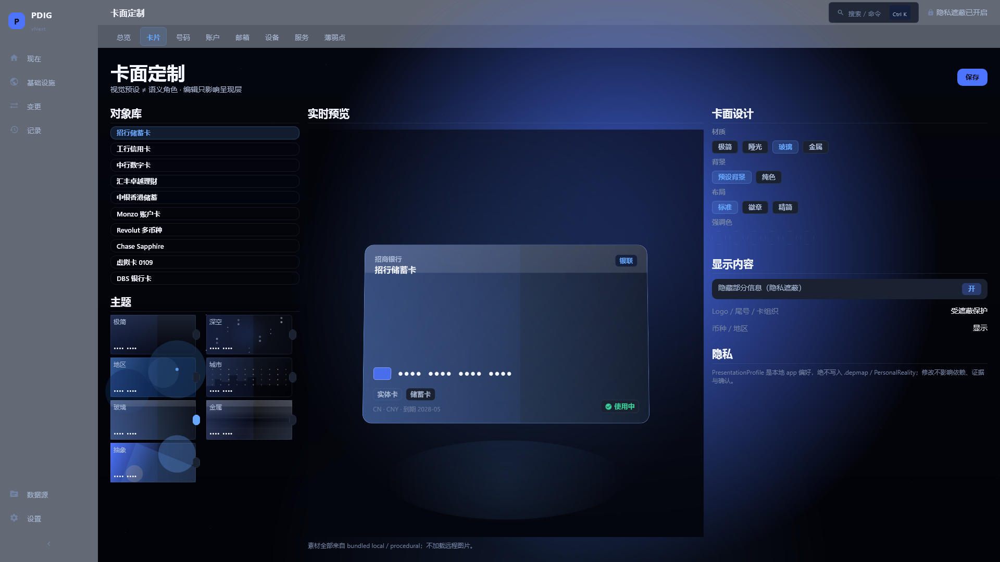

### F3. Card Customization · metal

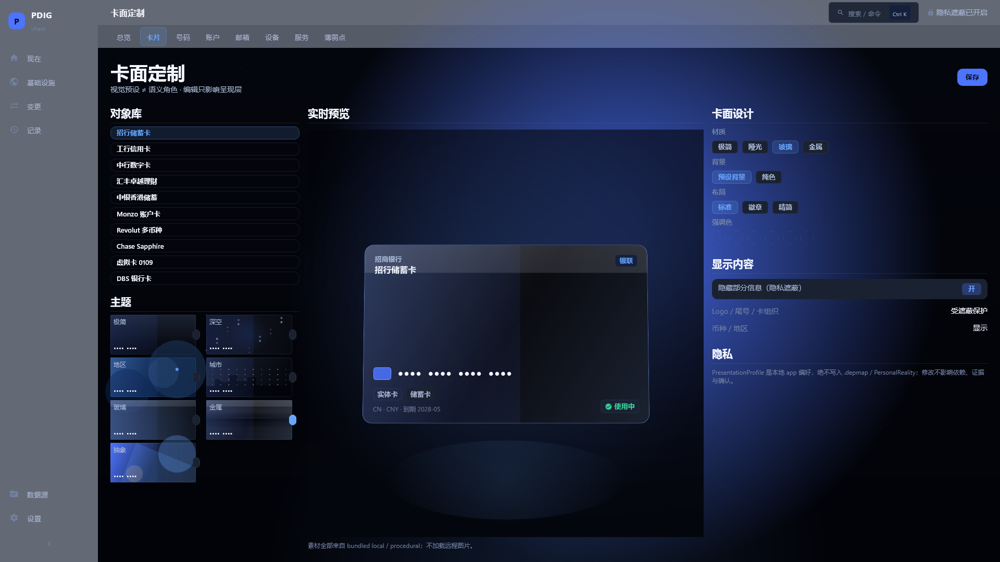

### F4. Card Customization · city

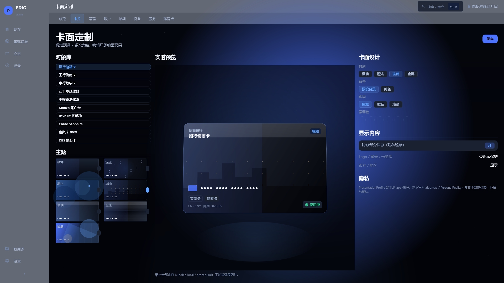

### G. Number Detail

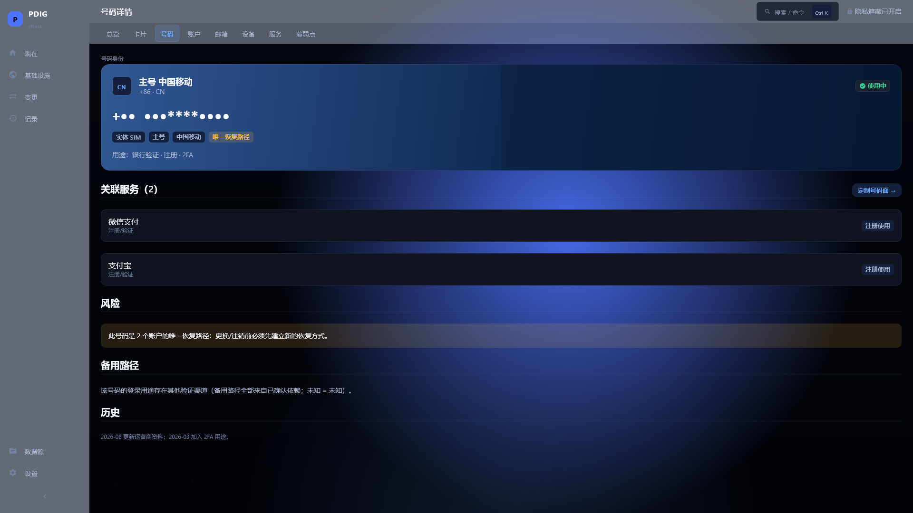

### H1. Number Customization · country

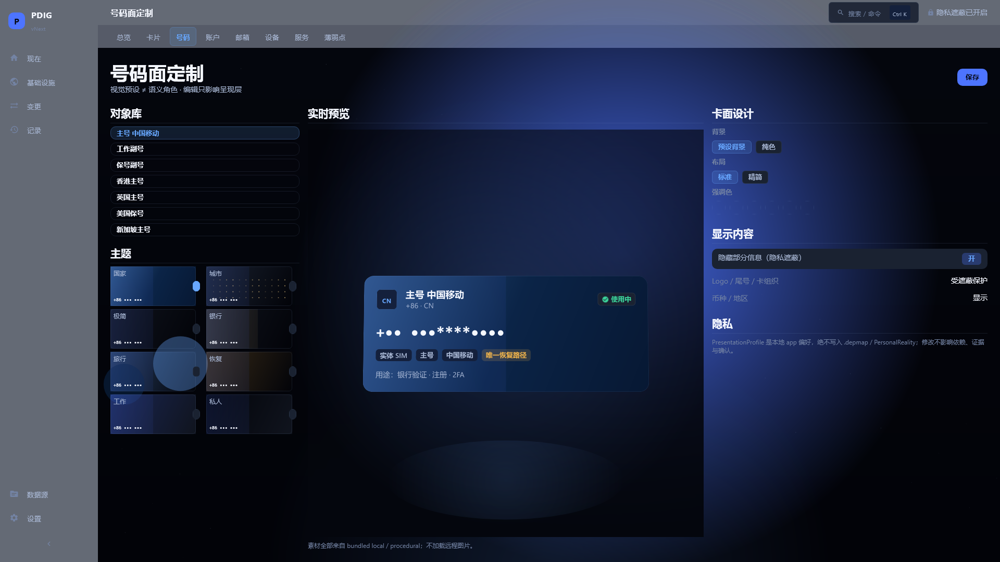

### H2. Number Customization · banking

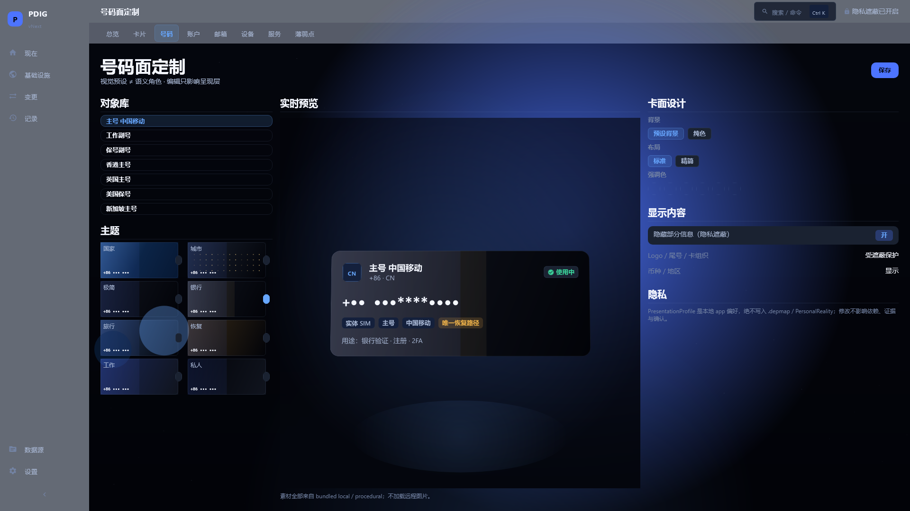

### H3. Number Customization · travel

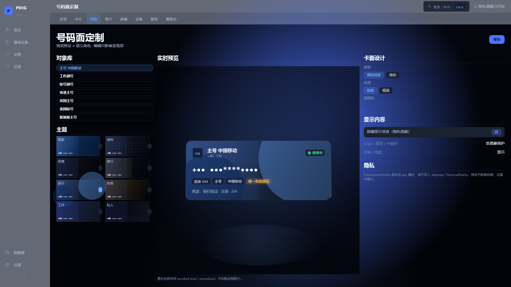

### I. Change Phone

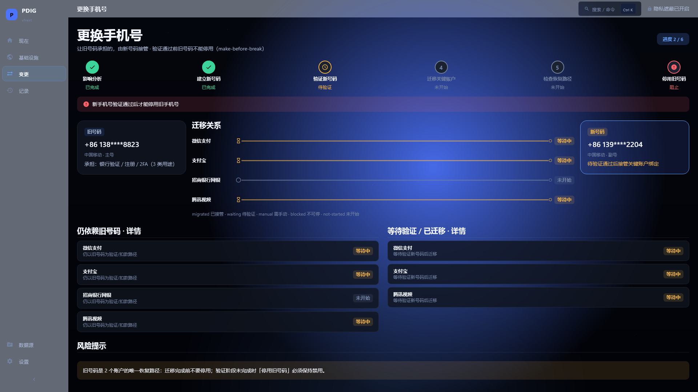

### J. Globe Close-up

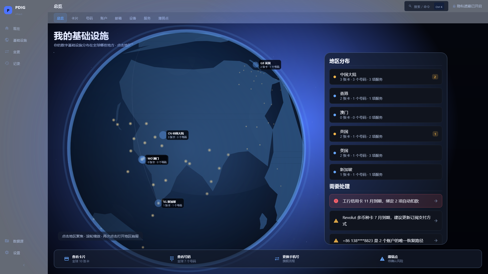

## 评审包与证据文件

- rtifacts/runtime-evidence/2026-10-02-ui-vnext-phase1b/IMAGE_METRICS.json（15 帧：0 error / 0 empty bbox / 0 near-black；meanLum 0.126）
- rtifacts/runtime-evidence/2026-10-02-ui-vnext-phase1b/EVIDENCE_SHA256SUMS.txt（证据指纹）
- Reference Visual Contracts：spec/ui-vnext/REFERENCE_VISUAL_CONTRACT_<id>.md（4 份）
- Human-approved references：spec/ui-vnext/references/（4 PNG，SHA256 见 REFERENCE_MANIFEST.json）
