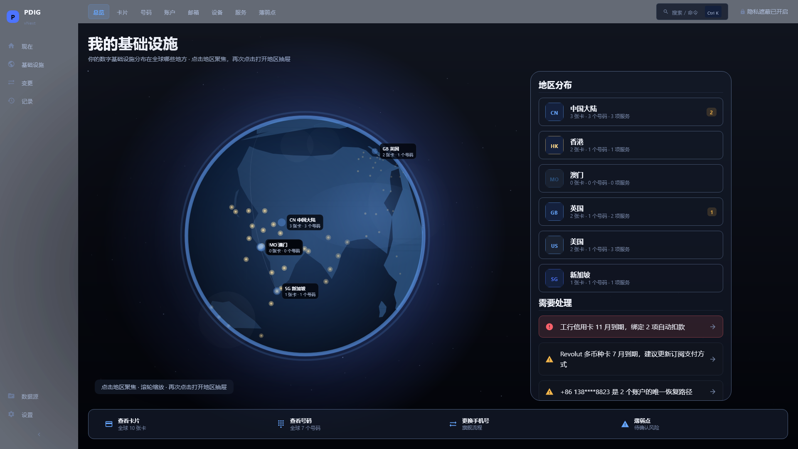
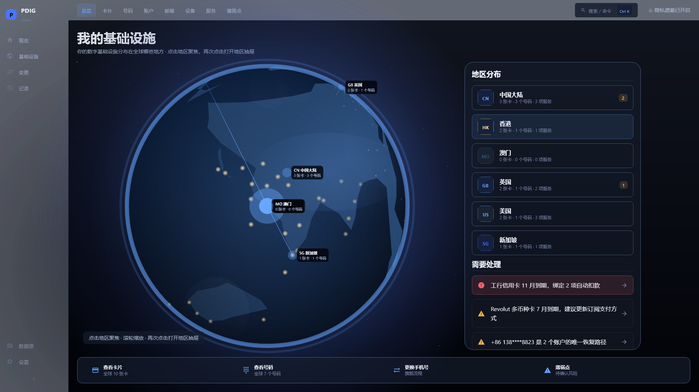
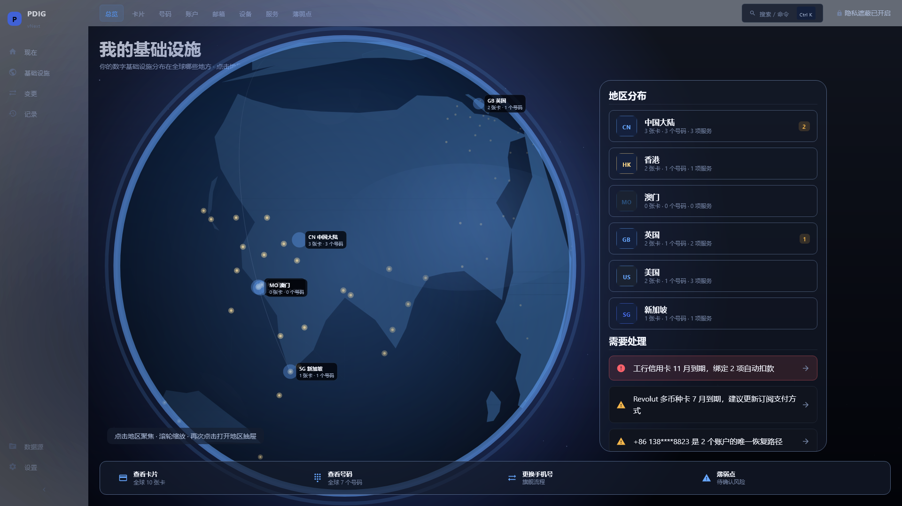
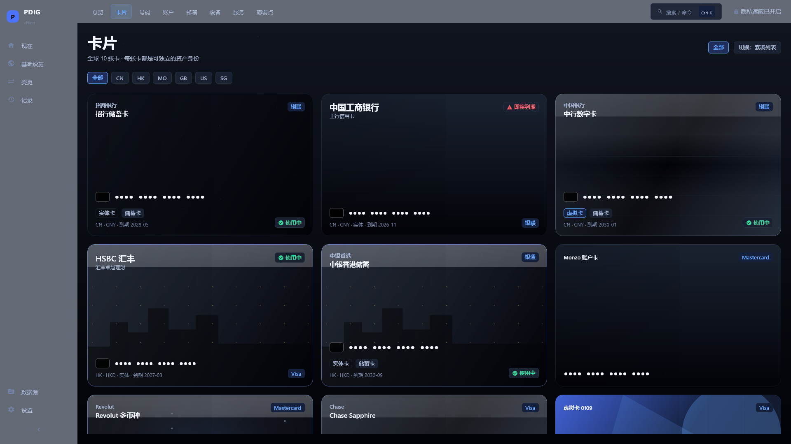
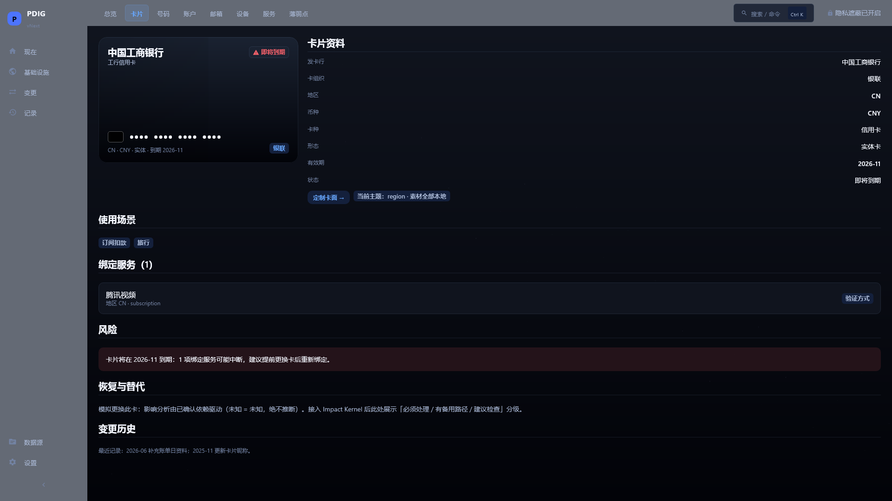
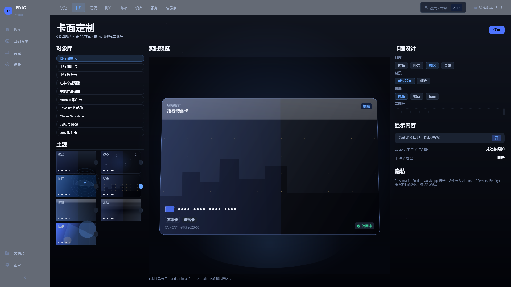
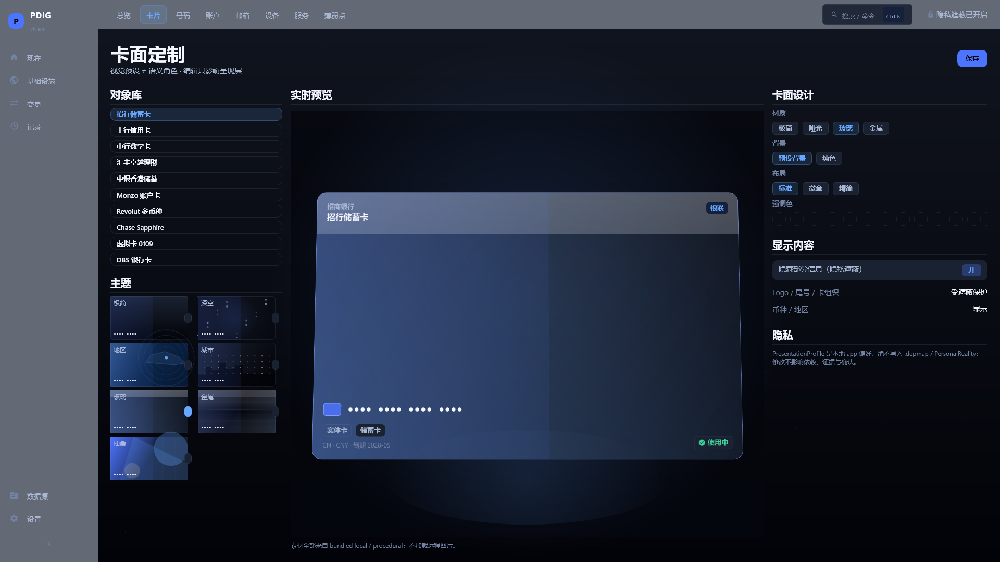
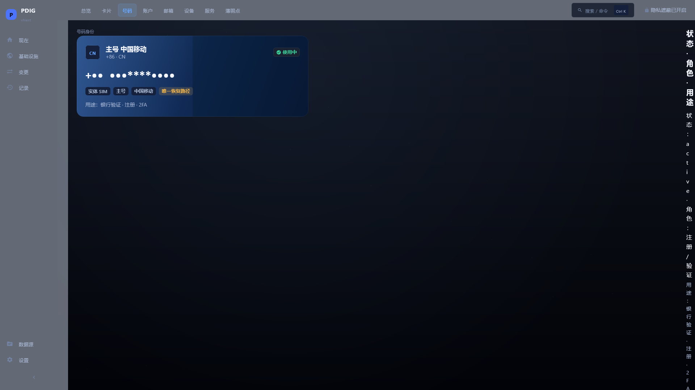
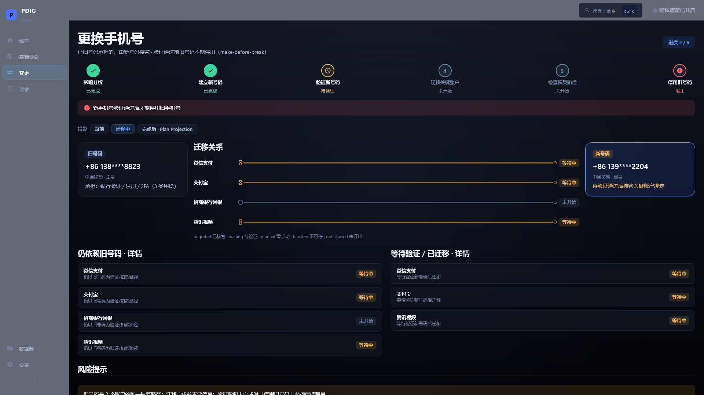

# PDIG UI vNext — PHASE 1C 关键帧（Renderer Upgrade）

> No-Vision Blind Agent 证据陈列。`PHASE_1C_IMPLEMENTED = PASS`、`VISUAL_CRAFT = NEEDS_HUMAN_REVIEW`、`REFERENCE_PARITY = NEEDS_HUMAN_REVIEW`。全部 synthetic fixture，隐私遮蔽开启。

依据 Human Visual Review 2026-10-01（PHASE 1C，Review §31）的 8 项最小证据集：

### 1. Infrastructure Overview — global

### 2. Infrastructure Overview — HK focus

### 3. Globe Close-up

### 4. Cards

### 5. Card Detail

### 6a. Card Customization — City

### 6b. Card Customization — Glass

### 7. Number Detail

### 8. Change Phone — Transition state

## 评审包与证据文件

- `artifacts/runtime-evidence/2026-10-03-ui-vnext-phase1c/IMAGE_METRICS.json`（9 帧：0 error / 0 empty / 0 near-black；meanLum 0.102）
- `artifacts/runtime-evidence/2026-10-03-ui-vnext-phase1c/EVIDENCE_SHA256SUMS.txt`
- OFFLINE_TEXTURE_EARTH 资产：`spec/ui-vnext/assets/`（albedo/night/cloud PNG + `ASSET_MANIFEST.json`，sha256/license 记录）
- Renderer 拆分：`globe/EarthRenderer.kt`、`TextureEarthRenderer.kt`、`VectorEarthFallbackRenderer.kt`、`EarthMaterialAssets.kt`、`EarthLighting.kt`、`EarthAtmosphere.kt`、`EarthRegionOverlay.kt`
- CardVisualRenderer：`ui/components/CardVisualRenderer.kt`（CardMaterial/CardArtwork/CardLayout/CardContent/CardStatusOverlay）
- LocalLightSource：`ui/components/LocalLightSource.kt`（分页光源）
