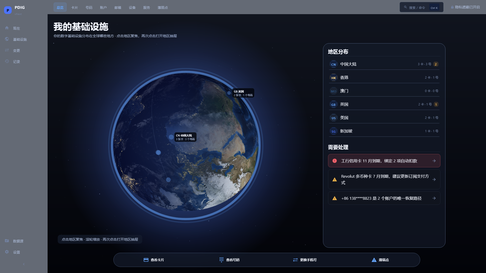
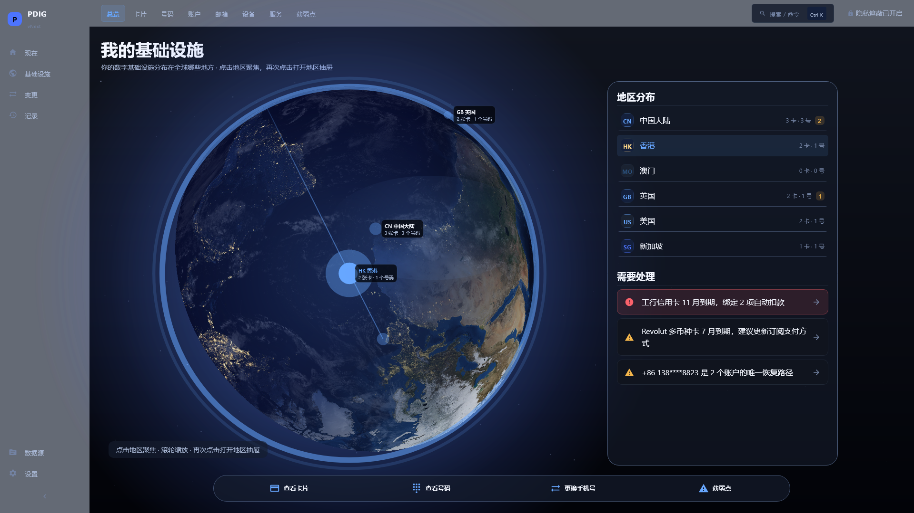
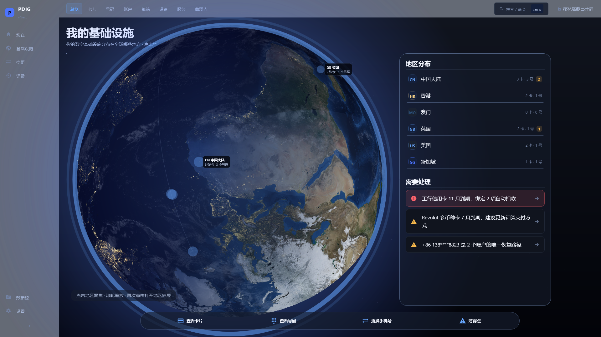
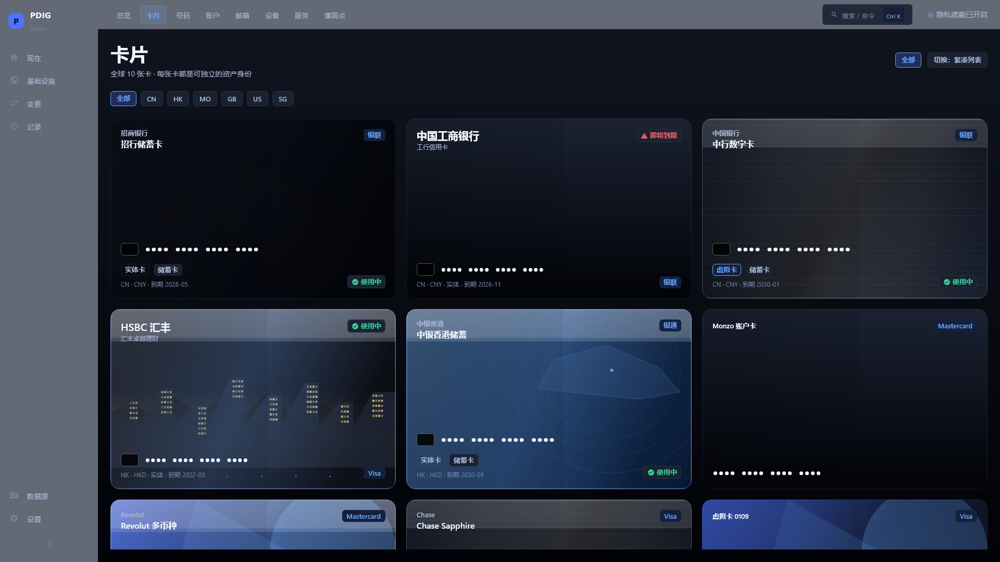
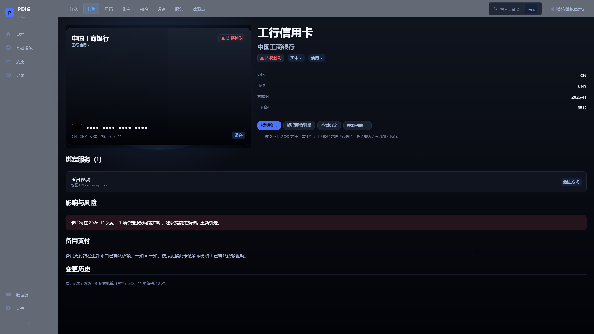
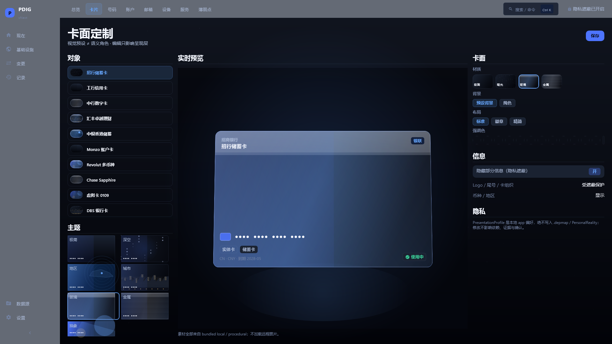
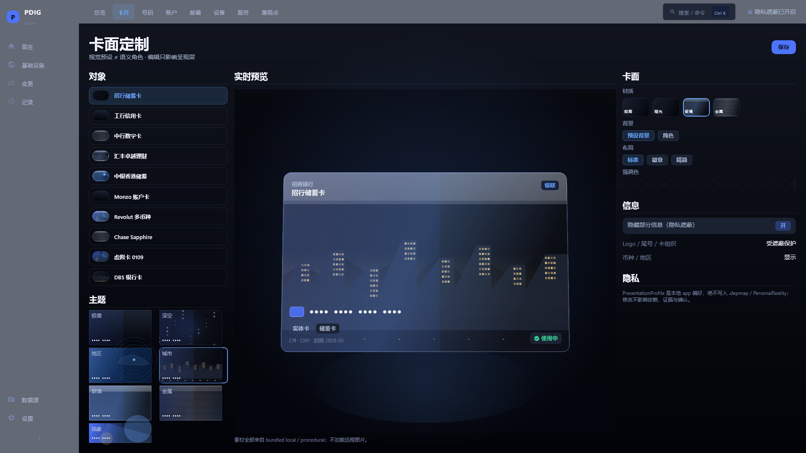
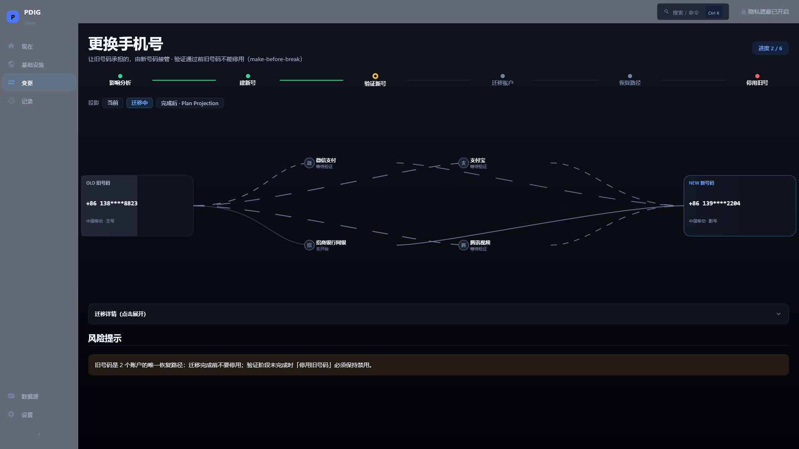
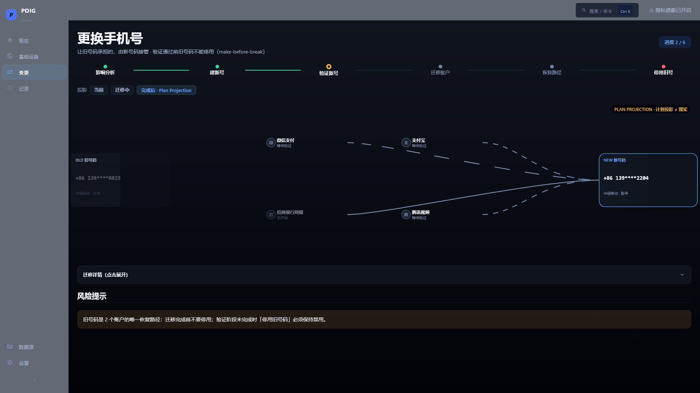

# PDIG UI vNext — PHASE 1D 关键帧（Desktop Reference Convergence & Visual Productization）

> No-Vision Blind Agent 证据陈列。`REFERENCE_CONVERGENCE_IMPLEMENTED = PASS`、`VISUAL_CRAFT = NEEDS_HUMAN_REVIEW = TRUE`。
> 依据 PHASE 1D brief（2026-10-01）10 张最小证据集 + Number Detail geometry probe。
> 全部 synthetic fixture，隐私遮蔽开启，1920×1080 离屏确定性渲染。

### 1. Infrastructure Overview — global

### 2. Infrastructure Overview — HK focus

### 3. Globe Close-up

### 4. Cards

### 5. Card Detail

### 6. Card Studio — Glass

### 7. Card Studio — City/Region

### 8. Number Detail

### 9. Change Phone — Transition

### 10. Change Phone — After Projection

## 评审包与证据文件

- `artifacts/runtime-evidence/2026-10-01-ui-vnext-phase1d/IMAGE_METRICS.json`（10 帧：0 error / 0 empty / 0 near-black；meanLum 0.071–0.158）
- `artifacts/runtime-evidence/2026-10-01-ui-vnext-phase1d/EVIDENCE_SHA256SUMS.txt`
- `artifacts/runtime-evidence/2026-10-01-ui-vnext-phase1d/UI_LAYOUT_PROBE.json`（**Number Detail geometry probe**：identity 36% / summary 32% / recovery 32%；`summary width 538px >= 300dp @1920` → passed=true；`verticalTextRegression=0`、`clippedPrimaryLabels=0`）
- REAL_EARTH_ASSET_PIPELINE：`spec/ui-vnext/assets/ASSET_MANIFEST.json`（NASA Visible Earth 公开领域：Blue Marble Next Generation albedo / Earth at Night 2012 / cloud composite；source/license/sha256/resolution/retrievedAt/usage 全记录；runtime 零网络）
- Renderer 拆分（≤300 行）：`globe/EarthRenderer.kt`、`TextureEarthRenderer.kt`、`VectorEarthFallbackRenderer.kt`、`EarthMaterialAssets.kt`、`EarthLighting.kt`、`EarthAtmosphere.kt`、`EarthRegionOverlay.kt`
- 卡片：`ui/components/CardVisualRenderer.kt`（MATTE/GLASS/METAL/MINIMAL perceptual contract + 多层城市天际线）、`CardFace.kt` + `CardFaceContent.kt`（≤300 行拆分）
- Number Identity：`ui/components/NumberIdentitySurface.kt`（全球通信身份 + continuity ring）
- Continuity Scene：`ui/screens/ContinuityScene.kt`（Compose Canvas：OLD ← 服务卫星节点 → NEW，Bezier 曲线，migrated/waiting/blocked/not_started 语义 + PLAN PROJECTION 标注）
- 状态文档：`PHASE_1D_IMPLEMENTATION_REPORT.md`、`WORK_STATUS.md`、`BLOCKERS.md`
