# PDIG UI vNext — PHASE 1E 关键帧（Desktop Final Visual Acceptance & Interaction Closure）

> No-Vision 盲实现证据陈列。`PHASE_1E_IMPLEMENTATION = PASS`；`VISUAL_CRAFT = NEEDS_HUMAN_FINAL_REVIEW`。
> 依据 PHASE 1E brief（2026-10-05）：**16 张** Human Review 主截图（§71）+ mechanical profiles + 交互/持久化证据。
> 全部 synthetic fixture、隐私遮蔽默认开启、1920×1080 离屏确定性渲染（in-process harness 标准，用户已确认）。

## 16 张主截图（按 §71 顺序：Global → Assets → Customization → Continuity → States）

### 1. Now（现在）

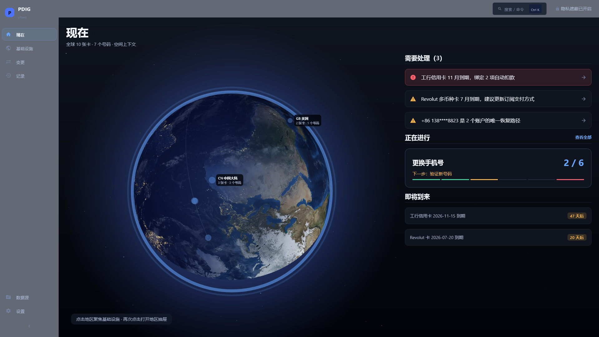

### 2. Overview global（基础设施总览 · 全球）

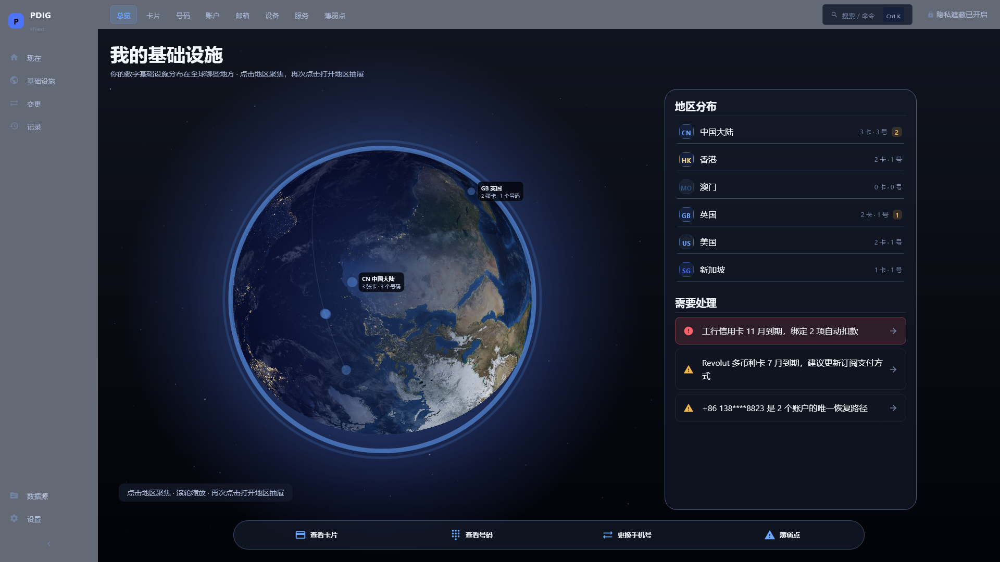

### 3. Overview HK（基础设施总览 · 香港聚焦）

### 4. Globe Closeup（地球特写）

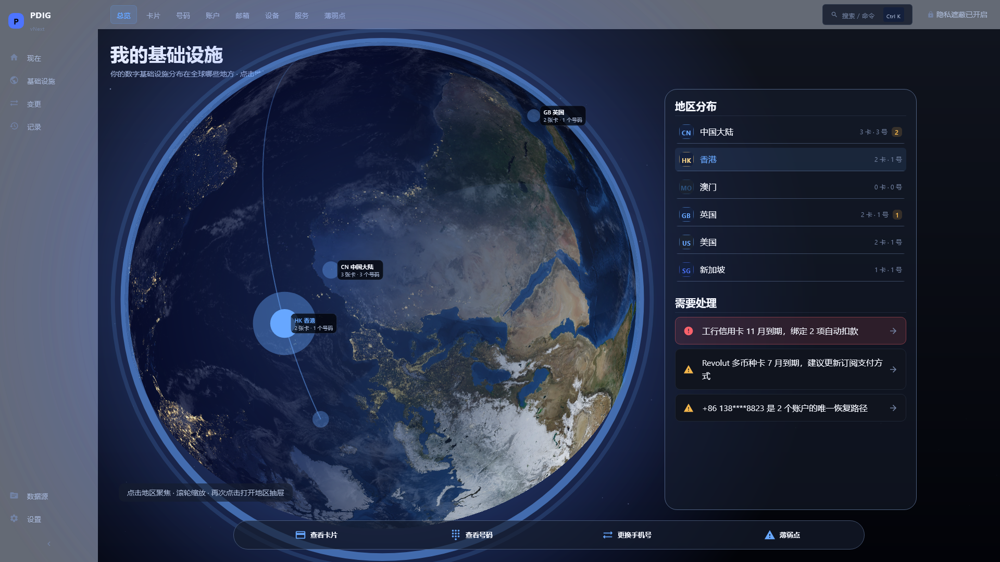

### 5. Cards（卡片网格）

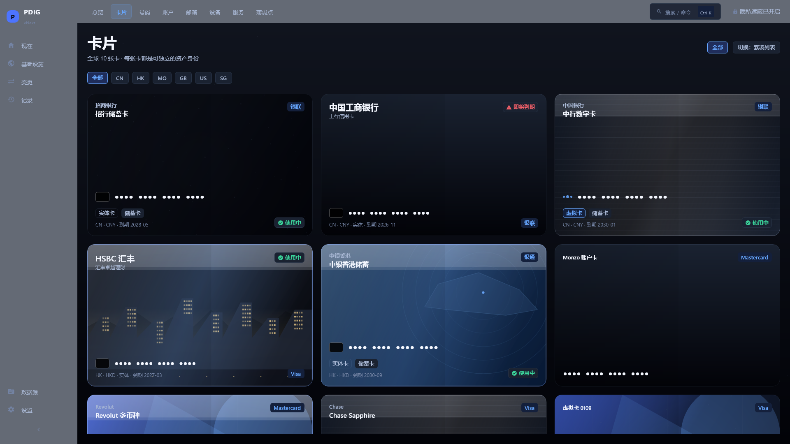

### 6. Card Detail（卡片详情）

### 7. Card Studio — Glass（卡面定制 · 玻璃）

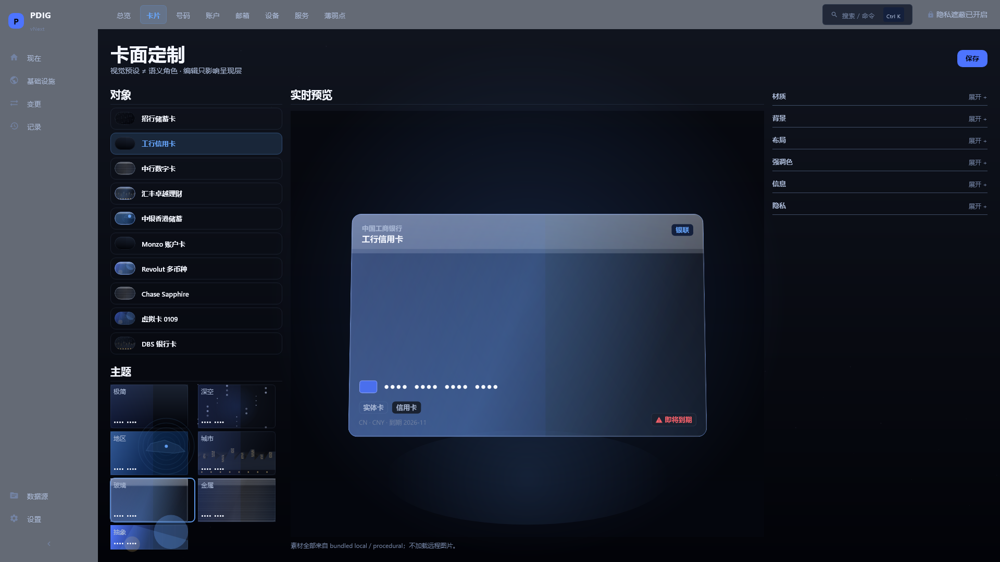

### 8. Card Studio — City（卡面定制 · 城市）

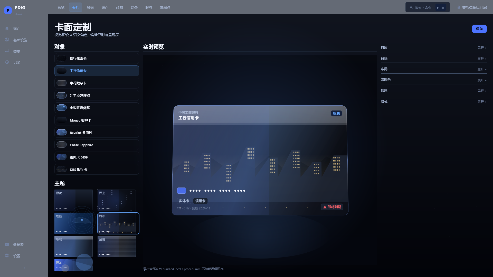

### 9. Numbers（号码列表）

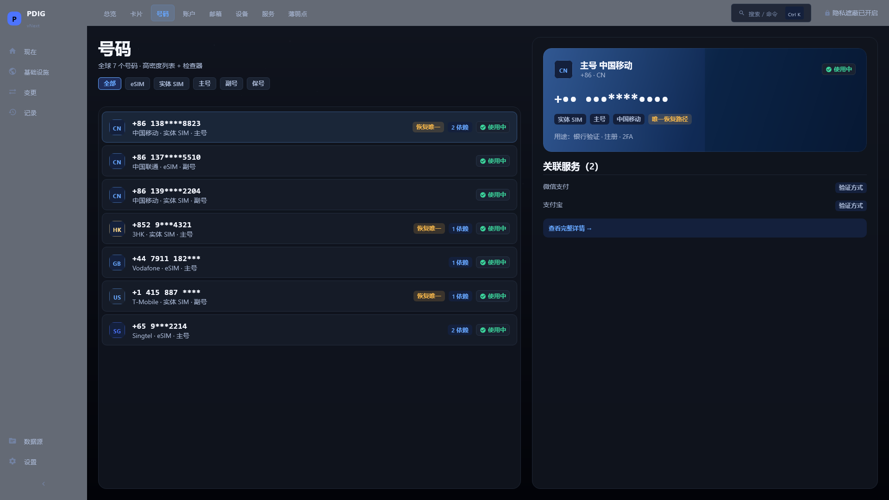

### 10. Number Detail（号码详情）

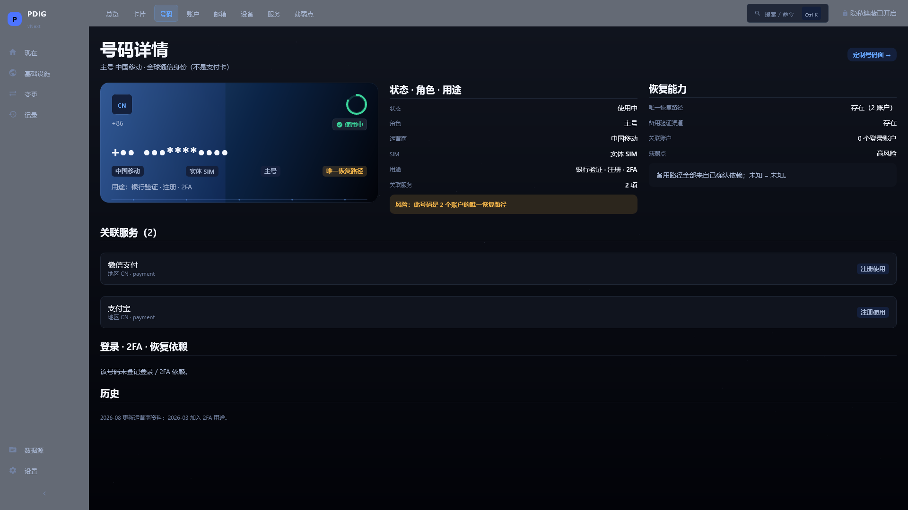

### 11. Number Studio — Travel（号码面定制 · 旅行）

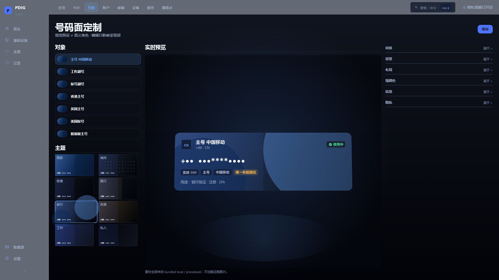

### 12. Change Phone — Current（更换手机号 · 当前）

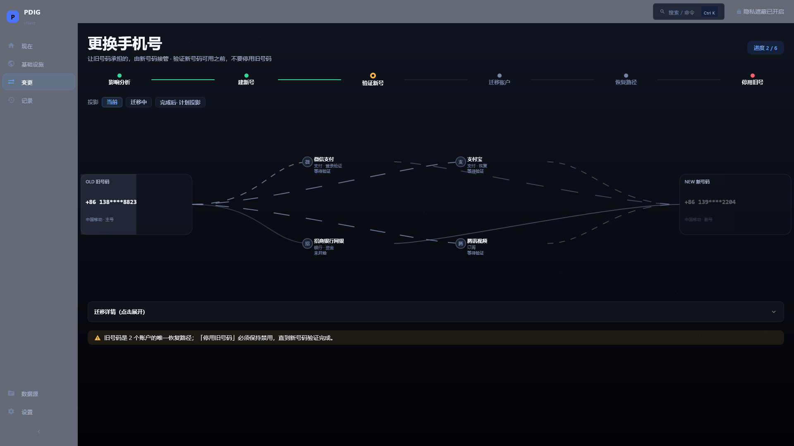

### 13. Change Phone — Transition（更换手机号 · 迁移中）

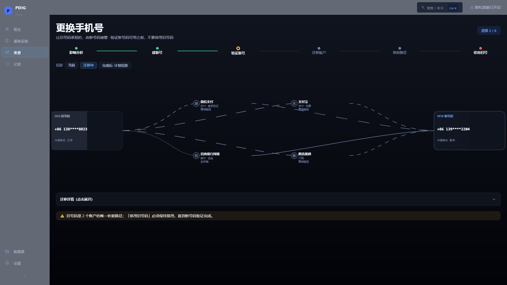

### 14. Change Phone — After（更换手机号 · 计划投影）

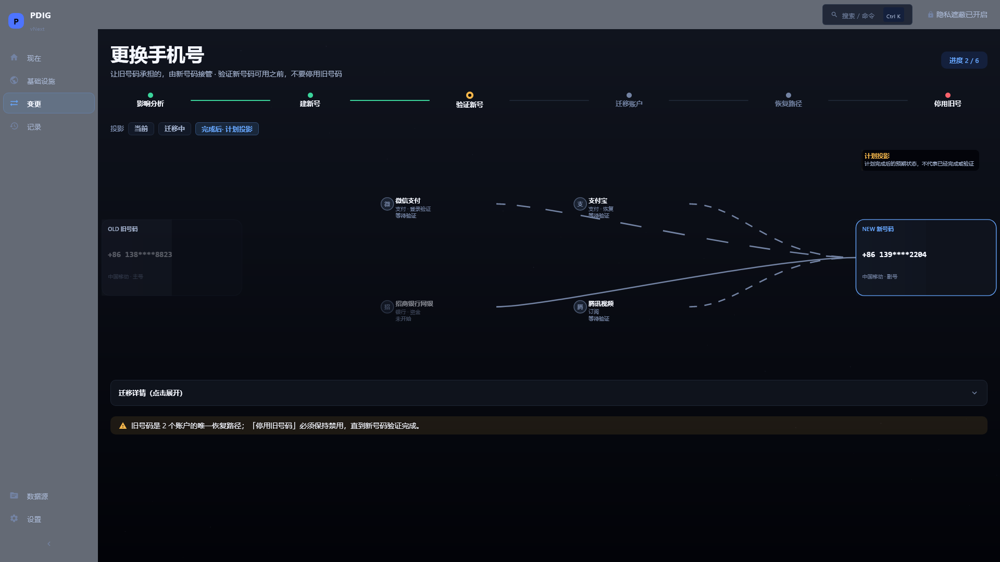

### 15. Cards Empty（卡片空状态，§45）

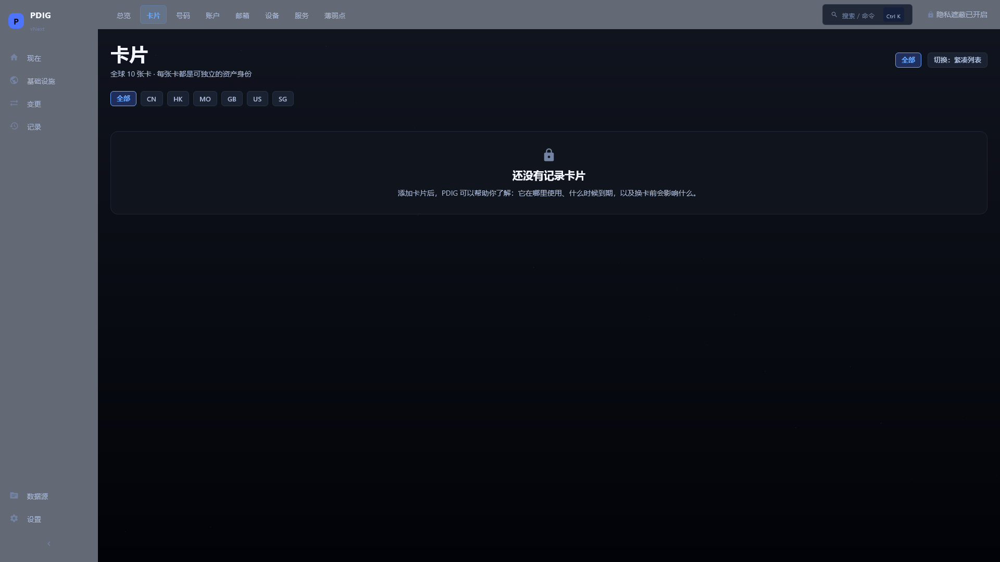

### 16. Command Palette（命令面板，Ctrl+K）

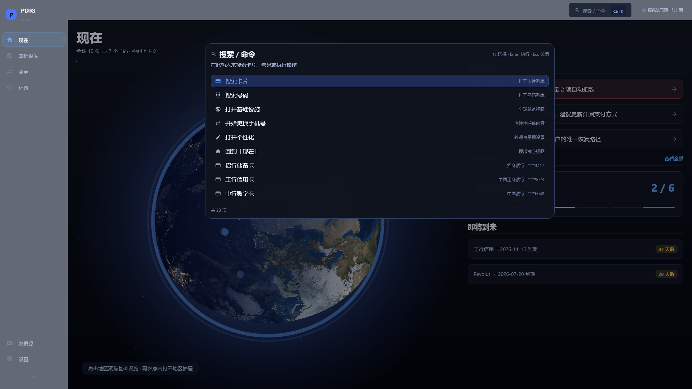

## 机械验证（不进入 Human Review 主集）

- `mechanical/1280x720@1.0/`、`mechanical/2560x1440@1.0/`、`mechanical/1920x1080@1.25/`、`mechanical/1920x1080@1.5/`
  代表性屏幕：overview / card studio / change-phone / number-detail / cards。

## 证据文件

- `IMAGE_METRICS.json`：16 帧，0 error / 0 empty / 0 near-black（meanLum 0.062–0.160）。
- `EVIDENCE_SHA256SUMS.txt`：全部 PNG 的 SHA-256。
- `UI_LAYOUT_PROBE.json`：Continuity Scene 高度 430px（420–500 区间内）、Studio 中央预览宽度 ≥620px @1920、Number Detail 36/32/32 保持。
- `INTERACTION_LOG.txt` + `KEYBOARD_LOG.txt`：15 步 journey + 键盘证据（§64 / AC3 / AC5）。
- `PROFILE_PERSISTENCE_EVIDENCE.json`：外观设置编辑 → 保存 → 重开保留（AC2 / §66）。
- `journey/`：15 张 journey 关键帧。
