# PDIG UI vNext — PHASE 1F 关键帧（Desktop Final Craft, Reference Freeze & Acceptance Candidate）

> No-Vision 盲实现证据陈列。`PHASE_1F_IMPLEMENTATION = PASS`；`DESKTOP_VISUAL_REFERENCE = NEEDS_HUMAN_FINAL_ACCEPTANCE`。
> 依据 PHASE 1F brief（2026-10-02）**§50：恰好 12 张** Human Review 主截图 + mechanical profiles + journey/真实窗口证据。
> 全部 synthetic fixture、隐私遮蔽默认开启、1920×1080（离屏确定性渲染 + 真实窗口运行时 smoke）。

## 12 张主截图（§50 顺序）

### 1. Now（现在）

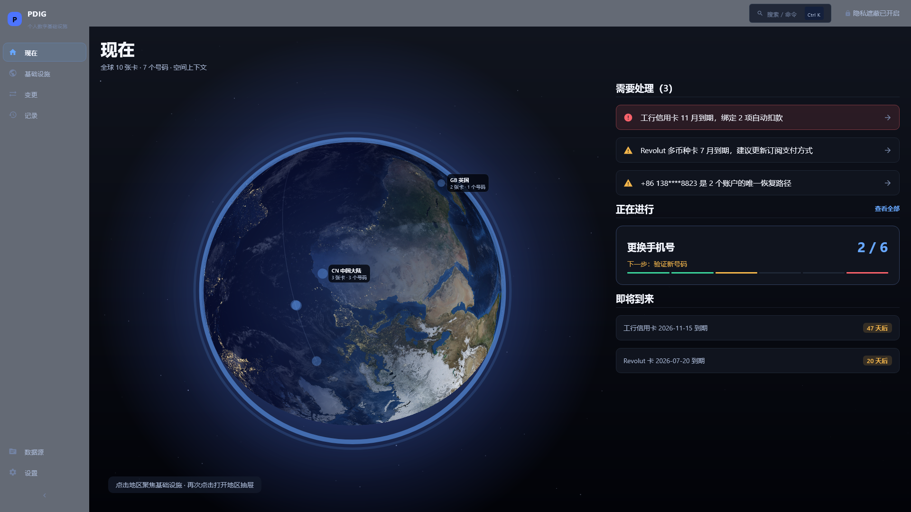

### 2. Infrastructure Overview（基础设施总览）

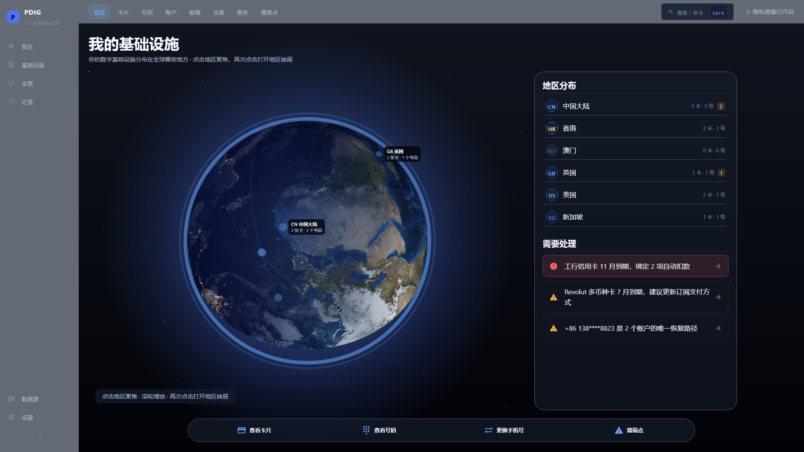

### 3. Cards（卡片网格）

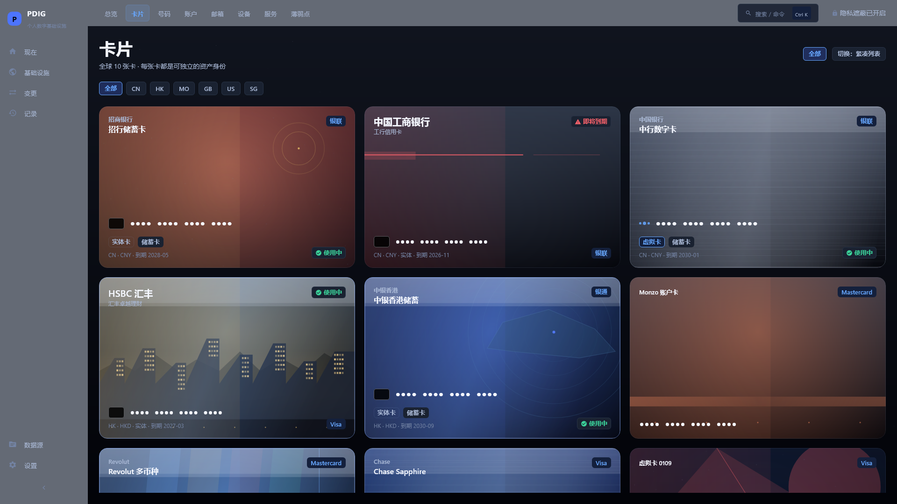

### 4. Card Detail（卡片详情）

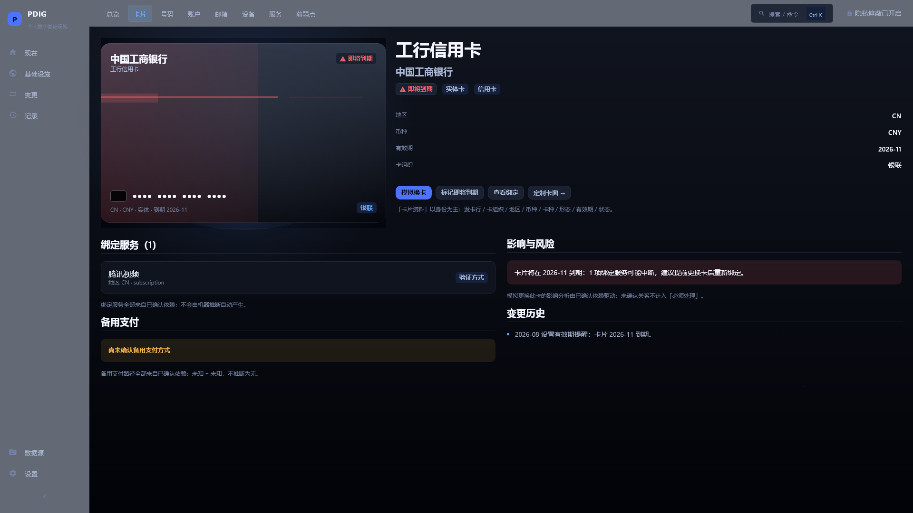

### 5. Card Studio — Glass（卡面定制 · 玻璃）

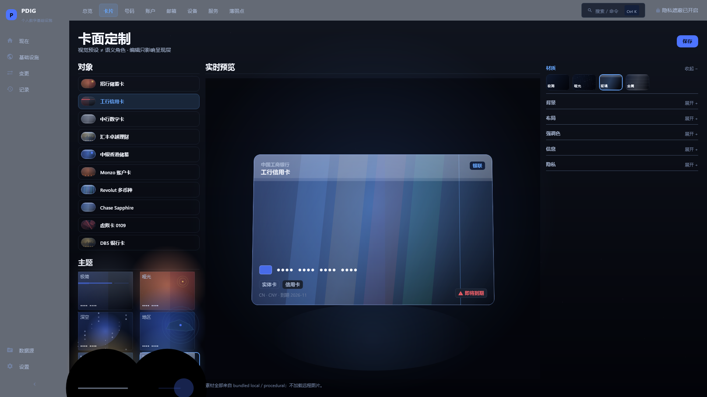

### 6. Card Studio — City（卡面定制 · 城市）

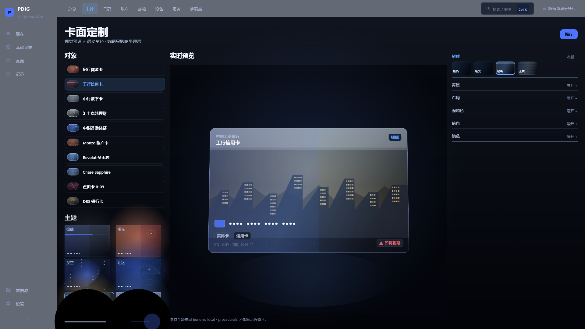

### 7. Numbers（号码列表）

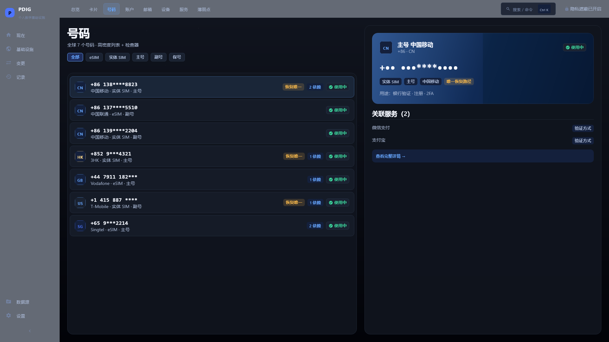

### 8. Number Detail（号码详情）

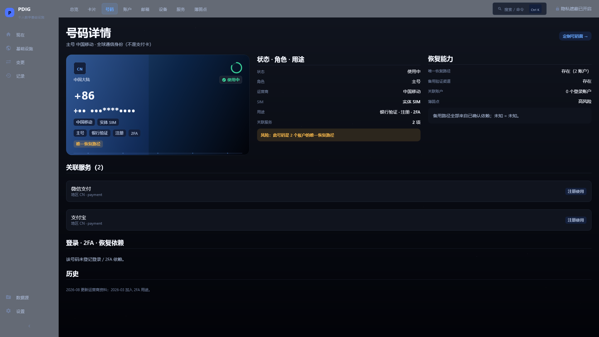

### 9. Number Studio — Travel（号码面定制 · 旅行）

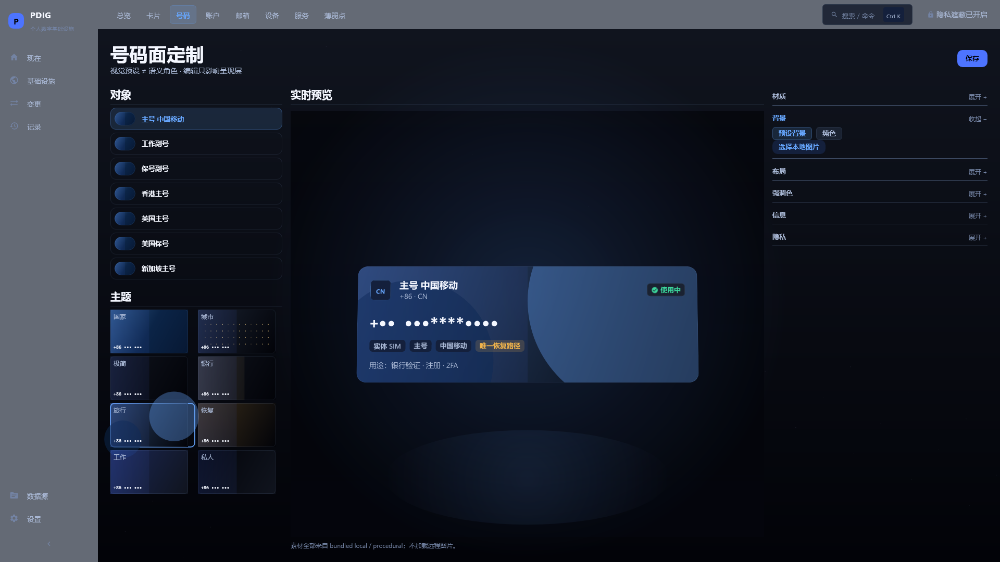

### 10. Change Phone — Transition（更换手机号 · 迁移中）

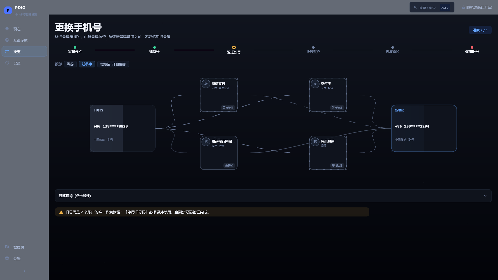

### 11. Change Phone — After（更换手机号 · 计划投影）

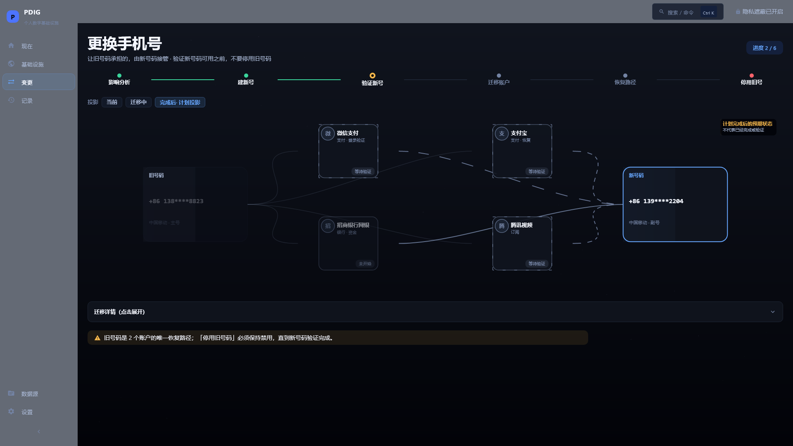

### 12. Cards Empty（卡片空状态）

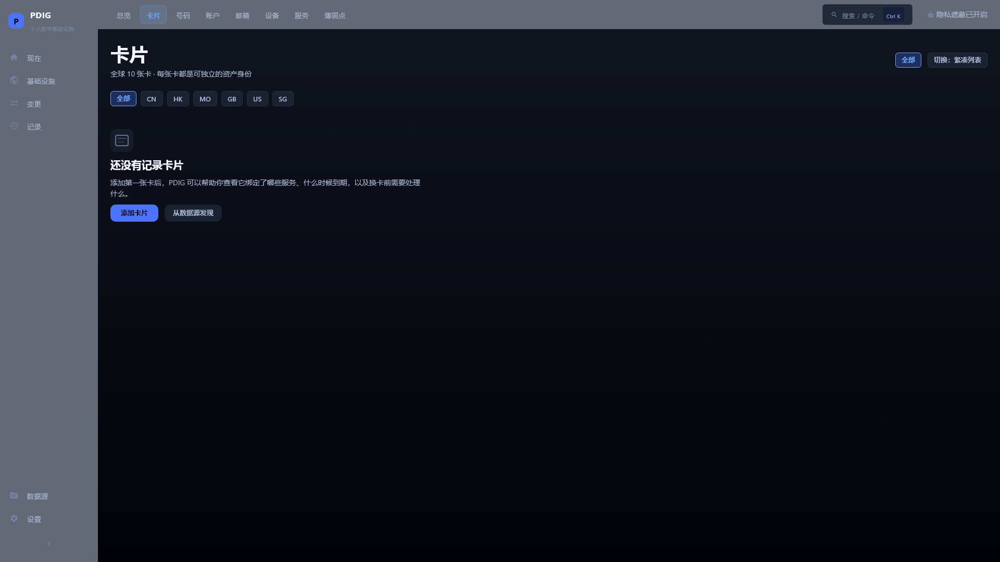

> 12 张中不包含 Globe 特写与 Command Palette（§50：除非 Globe 有变或出现回归）。

## 机械验证（不进入 Human Review 主集）

- `mechanical/1280x720@1.0/`、`mechanical/2560x1440@1.0/`、`mechanical/1920x1080@1.25/`、`mechanical/1920x1080@1.5/`：overview / card-studio / change-phone / number-detail / cards。
- `mechanical/empty-states/`：numbers-empty / now-empty / region-empty / card-detail-empty（§39/§40 证据帧）。

## 真实窗口运行时（§49）

- `real-window/`：真实 Compose Desktop 窗口 16 步 smoke 窗口级截图 + `WINDOW_SMOKE_LOG.txt`（14/16 capture=true；
  Ctrl+K 因本会话无法授予 OS 输入焦点 → `REAL_WINDOW_KEYBOARD_HUMAN_GATE`；中文 IME → `IME_RUNTIME_HUMAN_GATE`，均不伪造 PASS）。

## 证据文件

- `IMAGE_METRICS.json`：12 帧，meanLum 0.061–0.218，0 error / 0 empty / 0 near-black。
- `UI_LAYOUT_PROBE.json`：scene 430px、OLD/NEW 252.6px、service node 143.14px、path 2.5/2/1.5px、studio preview 668px —— passed=true。
- `EVIDENCE_SHA256SUMS.txt`；`INTERACTION_LOG.txt` + `KEYBOARD_LOG.txt` + `IME_LOG.txt`；
  `PROFILE_PERSISTENCE_EVIDENCE.json`（编辑→保存→重开保留）。
